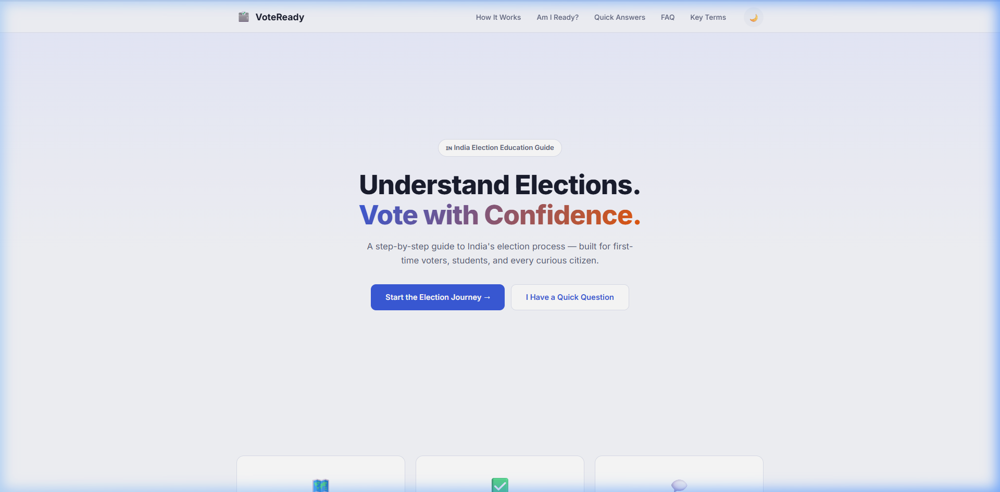
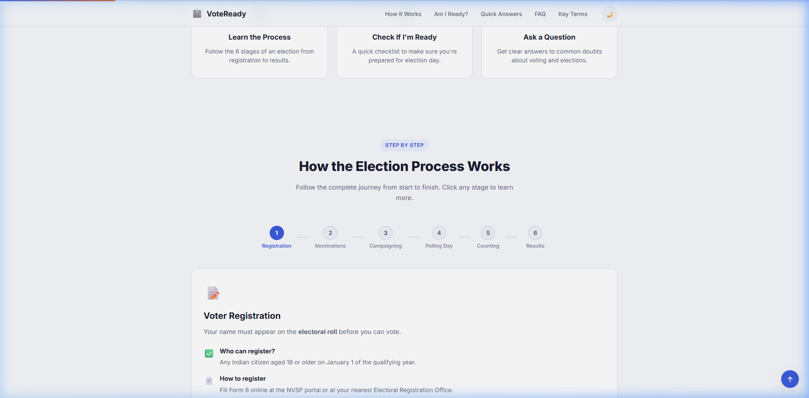
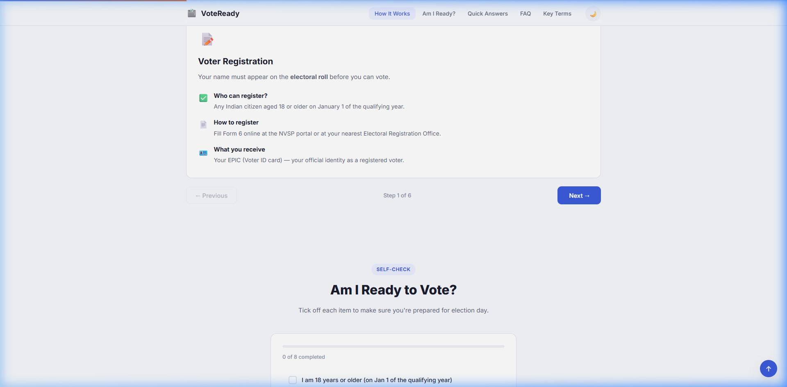
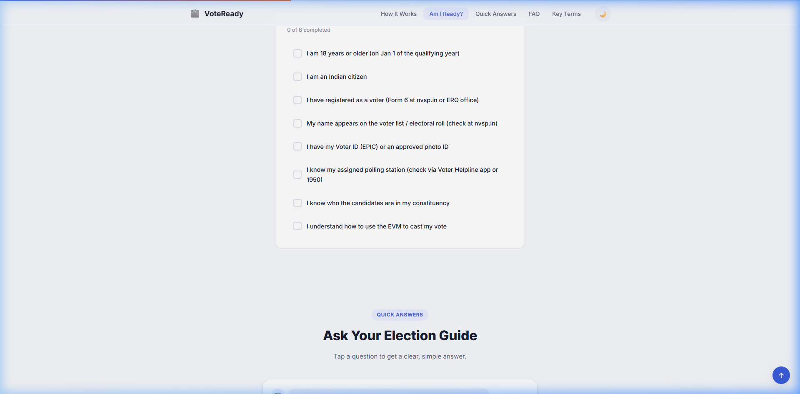
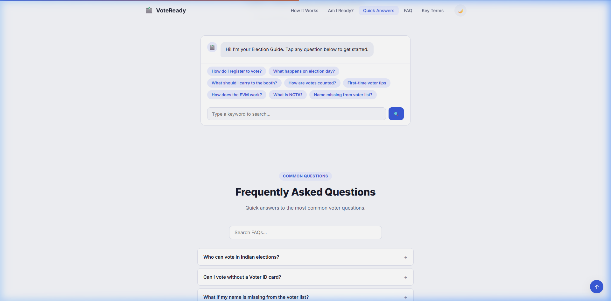
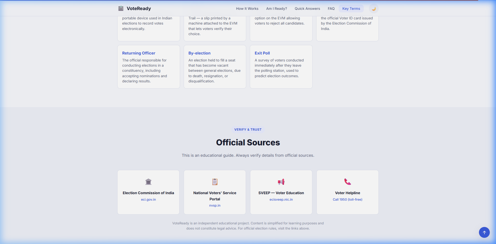

# 🗳️ VoteReady — Your Election Guide

**An interactive election education assistant that helps first-time voters understand India's election process step by step.**

Built as a static, zero-dependency hackathon submission focused on first-time Indian voters.

---

## 🎯 Problem

Millions of first-time voters in India don't clearly understand how elections work. Official resources are scattered across multiple government sites, filled with legal language, and hard to navigate. There is no single, interactive, beginner-friendly guide that walks a voter through the complete process — from registration to results.

## 💡 Solution

**VoteReady** is a guided web-based assistant that explains India's election process in plain language, through an interactive step-by-step flow. It's designed for first-time voters, students, and anyone who wants a clear, trustworthy, and visual understanding of elections — without political bias.

The app is structured as a **guided journey**, not a reference page:

**Start here → Learn the 6 stages → Check if you're ready → Ask questions → Verify with official sources**

---

## ✨ Features

| Feature | Description |
|---|---|
| 🏠 **Guided Hero** | One clear call-to-action that starts the user on a learning path |
| 🧭 **Start Here** | 3 quick-path cards based on user goals: learn, check readiness, or ask a question |
| 🗺️ **Election Journey** | Interactive 6-stage stepper: Registration → Nominations → Campaigning → Polling Day → Counting → Results |
| ✅ **Voter Readiness** | "Am I Ready to Vote?" — 8-item checklist with progress bar and completion feedback |
| 💬 **Election Guide** | Chat-style assistant with 8 preloaded answers and keyword search |
| ❓ **FAQ** | 10 searchable frequently asked questions with accordion UI |
| 🔍 **Myths vs Facts** | 5 common election myths debunked with factual explanations |
| 📖 **Glossary** | 15 key election terms explained simply, with live search |
| 🏛️ **Official Sources** | Trust block linking to ECI, NVSP, SVEEP, and Voter Helpline (1950) |
| 🌗 **Dark/Light Mode** | User-preferred theme with localStorage persistence |
| 📱 **Responsive** | Works on mobile, tablet, and desktop |
| 📊 **Progress Bar** | Scroll-based reading progress indicator |

---

## 📸 Screenshots

| Hero & Navigation | Start Here Quick-Path |
|---|---|
|  |  |

| Election Journey Stepper | Voter Readiness Checklist |
|---|---|
|  |  |

| Chat Assistant & FAQ | Official Sources |
|---|---|
|  |  |

---

## 🛠️ Tech Stack

| Layer | Technology |
|---|---|
| Structure | HTML5 (semantic, accessible) |
| Styling | CSS3 (custom properties, responsive, dark mode) |
| Logic | Vanilla JavaScript |
| Typography | Google Fonts (Inter) |
| Dependencies | **None** |
| Build tools | **None** |
| Backend | **None** — fully static |

**Total repo size: ~741 KB** (including screenshots). Zero `node_modules`. Zero frameworks. Opens directly in any modern browser.

---

## 📂 Project Structure

```
election-process-education-assistant/
├── index.html          # Complete single-page application
├── style.css           # Design system, themes, responsive layout
├── script.js           # All data, interactivity, and features
├── screenshots/        # README screenshots
├── .gitignore
└── README.md
```

---

## 🚀 How to Run

```bash
# Clone the repo
git clone https://github.com/ManvithPanyam/election-process-education-assistant.git
cd election-process-education-assistant

# Option 1: Open directly in any modern browser
# Double-click index.html

# Option 2: Use a local server
npx serve .
# Opens at http://localhost:3000
```

No installation. No build step. No API keys. Just open and use.

---

## 🎬 Demo Flow

1. Click **"Start the Election Journey →"** from the hero
2. Walk through the **6-stage stepper** (Registration → Results)
3. Open the **"Am I Ready to Vote?"** checklist and tick a few items
4. Ask a question in the **Election Guide** assistant (e.g. "What should I carry to the booth?")

---

## 📋 Content Sources & Accuracy

This is an **educational guide** using simplified explanations. Content is informed by:

- [Election Commission of India (eci.gov.in)](https://www.eci.gov.in) — official election body
- [National Voters' Service Portal (nvsp.in)](https://www.nvsp.in) — voter registration
- [SVEEP (ecisveep.nic.in)](https://ecisveep.nic.in) — voter education program
- **Voter Helpline: 1950** (toll-free)

For official, legally binding information, users are directed to these sources within the app.

---

## 🎯 Design Principles

1. **Task-based navigation** — organized around what voters want to do, not institutional categories
2. **Plain language** — one idea per sentence, one task per block
3. **Politically neutral** — no party names, no bias, no persuasion
4. **Trust signals** — official source links, educational disclaimers, credible anchors
5. **Guided flow** — clear start point, logical progression, obvious next steps

---

## 🔮 Future Improvements

- [ ] Multi-language support (Hindi, Tamil, Bengali, etc.)
- [ ] Country selector for global election education
- [ ] AI-powered conversational assistant
- [ ] Quiz mode to test election knowledge
- [ ] Downloadable voter checklist PDF
- [ ] PWA support for offline access

---

## ⚠️ Disclaimer

VoteReady is an independent educational project built for a hackathon. Content is simplified for learning purposes and does not constitute legal advice. For official election rules and voter registration, visit [eci.gov.in](https://www.eci.gov.in).

---

## 👤 Author

**Manvith Panyam**


